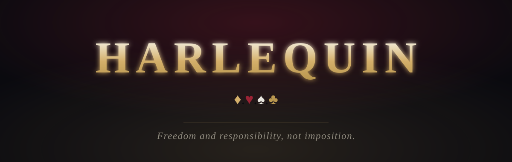

Harlequin is built to make people **more free and independent of the State** — not by force, but by giving them real autonomy: the tools, the knowledge, and the networks that lessen their dependence on power. A society apart, entered freely, where people cooperate and trade on their own terms.

It is built slowly, in layers, with care. Quality over speed.

◆

## The four suits

The mark of Harlequin carries the four suits. Each one is a value — and the reputation engine measures standing in exactly these four. The architecture tells the story: *your worth is counted in the four suits you earn.*

| | Suit | Stands for | Measured as |
|:---:|---|---|---|
| ♦ | Diamond | Ambition | enterprise and trade |
| ♥ | Heart | Love and family | care for the community |
| ♠ | Spade | Struggle | defending the society, judging wrongs |
| ♣ | Club | Freedom | building the tools that set people free |

Authority over the whole is the *conservative minimum* across the four: you cannot buy the standing of one suit with another. To be trusted with everything, be trustworthy in everything.

◆

## What is being built — in the open

- A **sovereign blockchain** whose consensus rests on **earned reputation**, not stake or wealth — no central authority decreeing who is right.
- A **reputation engine**: standing earned through provable acts, resistant to collusion and to Sybil attacks — power that cannot be bought, only earned.
- **Two coins**: a scarce store of value, and a high-throughput coin for everyday use.

Every line is open source, developed in public under the AGPL-3.0 — so that what frees people can never be closed again.

### → [**harlequin-chief/harlequin**](https://github.com/harlequin-chief/harlequin)

◆

*Every person who becomes a little more free is a victory.*

